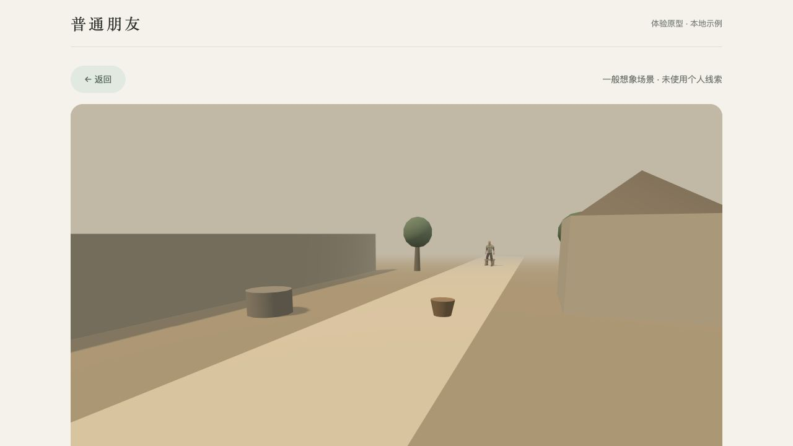

# 普通朋友 · Familiar

一个关于记忆、变化与相遇的公开探索项目。

如果一个人的外貌、声音和生活环境都变了，我们还能从某个动作、说话的节奏，或一个小习惯里认出熟悉的感觉吗？

**普通朋友**尝试把少量记忆变成一段可以安静观看的三维相遇：那个人在陌生的环境里过着自己的生活，偶尔回头、停下，或说一句话。你可以靠近看看，也可以随时离开。

项目借用“转世、心续”的想象来探索这种体验。场景、身份和台词属于创作，不代表逝者真实的现状、记忆或传讯。熟悉感是否成立，仍是一个开放问题。



## 正在探索什么

- **变化中的熟悉感**：让形象和音色变化，尝试保留来自记忆的行为线索，以及经过核对的说话节奏。
- **安静的相遇**：一段约 75 秒的生活片段，不要求持续聊天、完成任务或每天回来。
- **少量输入**：一句记忆、一张照片或一段录音，尽量减少开始体验前的负担。
- **可追溯的创作**：区分用户提供的线索与创作内容，允许核对、纠正、撤回和删除。
- **本地可运行**：使用开源语音模型与免费三维素材，让体验和实现都可以被检查、修改和复现。

## 现在可以体验什么

当前提供本地可运行的网页原型，已有：

| 部分 | 当前能力 |
| --- | --- |
| 场景 | 河岸小路、旧时庭院、农庄边缘、木工角落、山间小屋、集市收摊时六个风格化小场景 |
| 人物与表演 | 两个成人基础人物；坐下、坐着休息、起身、行走、待机、说话、跪姿查看木箱七个动画片段，以及回头等待的编排 |
| 观看 | 开启声音、暂停、继续、重看、转动视角、靠近或坐下看、退出 |
| 记忆 | 文字输入；记忆录音本地转写、核对后使用；有限规则识别等待同行者、修补物件等线索 |
| 照片 | 上传与格式处理；仅提供照片时询问一个可跳过的小习惯，跳过后进入明确标注的一般想象 |
| 声音 | 本地预设中文音色；核对参考录音后，有限地调整新声音的语速与短句间停顿 |
| 记录 | 准备进度、失败重试、历史回看、再次相遇、线索纠正、可跳过的反馈与资料删除 |

也可以直接进入无个人资料的示例。建议从合成记忆开始，例如：“他走路时总会回头等我。”

当前内容目标是 **六个场景、两个人物、八个动作**。第八个“拿起物件”动作正在接入与审核，尚未成为默认表演。已有相遇绑定人物、场景、声音和表演版本，后续改动保留旧版本资源供回看。

### 探索边界

场景由程序构建，人物来自固定素材库；当前没有根据照片生成本人外貌、自动提取照片中的个人线索，也没有复刻原声。台词与动作选择仍使用有限模板和规则，没有自由对话或无限生成的世界。

验证目前以合成资料、本地浏览器和临时数据库为主。照片线索、动作接触质量、手机真机表现、资源体积和部署流程仍在完善。真人体验与对照测试保留为后续研究事项，不作为当前落地闭环的完成门槛，也尚无已验证的效果结论。WebXR / VR 是后续方向，当前未开放。

## 本地运行

### 环境

- Node.js 22、pnpm 10.32.1。
- FFmpeg / FFprobe；HEIC / HEIF 照片转换还需要 `heif-convert`。
- 首次安装依赖和模型需要网络；模型下载后在本机推理，无需供应商账户或 API 密钥。

macOS 媒体工具：

```sh
brew install ffmpeg libheif
```

Ubuntu 24.04 媒体工具：

```sh
sudo apt-get install ffmpeg libheif-examples
```

### 安装

```sh
git clone https://github.com/haeliotang/familiar.git
cd familiar
pnpm install --frozen-lockfile
sh scripts/install-local-voice.sh
sh scripts/install-local-asr.sh
sh scripts/install-local-vad.sh
pnpm check:local
```

安装脚本使用固定下载来源并校验 SHA-256，模型保存在 `.models/`。公开台词样本已随仓库提供。

### 启动

在一个终端启动本地 API：

```sh
pnpm dev:local-api
```

在另一个终端启动网页：

```sh
pnpm dev
```

打开网页服务显示的本机地址，通常为 `http://127.0.0.1:5173/`。本地 API 默认使用端口 3001；开发服务均绑定本机地址。

开发模式使用 PGlite，无需额外启动 PostgreSQL 或 Docker。数据库写入 `.local-db/`，上传资料写入 `.local-assets/`。这两个目录、模型缓存和本地环境配置均不纳入 Git。公开素材与合成样本位于 `public/` 和 `artifacts/`，不要将私人资料放入这些目录。

### 检查与构建

```sh
pnpm check:local
pnpm exec vitest run --maxWorkers=2
pnpm build
```

数据库集成测试需要单独设置 `TEST_DATABASE_URL`，未设置时对应测试会跳过。请使用可丢弃的测试数据库，测试会创建、修改和清理数据。

仓库包含 [GitHub Actions 检查](.github/workflows/ci.yml)：安装固定模型与媒体工具，使用 PostgreSQL 17 运行测试和构建。自动检查覆盖工程行为，不替代动作观感、手机性能或真人效果评估。

正式 PostgreSQL 服务的环境配置、迁移、启动与回滚说明见 [部署文档](docs/deployment.md)。目前尚未完成面向公网的生产部署验证。

## 实现与素材

| 用途 | 当前选择 |
| --- | --- |
| 网页与三维 | TypeScript、React、Vite、Three.js |
| API 与存储 | Fastify、PostgreSQL；本地开发使用 PGlite |
| 语音合成 | Kokoro multilingual，通过 sherpa-onnx 本地运行 |
| 语音识别 | Whisper tiny |
| 语音活动检测 | Silero VAD |
| 图片与音频处理 | sharp、FFmpeg、libheif |
| 人物、服装与动画 | Quaternius 免费 Standard 素材，附来源记录与 CC0-1.0 许可 |

运行版本与模型指纹见 [依赖记录](dependency-lock.md) 和锁文件。第三方代码、模型与素材各自遵循其许可证；资源目录保留对应许可和来源，不能将素材许可证直接当作本项目全部源码的许可证。

## 项目地图

- [`src/`](src/)：页面、三维场景、人物表演、声音和播放控制。
- [`server/`](server/)：资料处理、匿名会话、准备任务、历史、删除和数据库迁移。
- [`scripts/`](scripts/)：模型安装、素材处理与本地验证工具。
- [`public/assets/`](public/assets/)：带版本的公开人物、动作与合成语音资源。
- [`docs/verification/`](docs/verification/)：验证过程、截图、发现的问题及其证据边界。
- [`artifacts/acceptance/`](artifacts/acceptance/)：合成功能集与声音实验记录；包含历史阶段的审计结论。
- [产品与技术开发文档](普通朋友_产品与技术开发文档_v0.1.md)：最初的体验设想与开发方案；当前范围调整见 [阶段说明](docs/verification/stage-push-2026-10-01.md)。

## 一起探索

欢迎通过 Issues 讨论体验想法、报告可复现的问题，或提出动作、声音和场景改进。尽量附上浏览器与系统版本、复现步骤及预期表现，使用合成资料举例，避免在公开讨论中上传私人照片、录音或凭据。

这个仓库会继续记录实现、失败和修正。希望每一轮改动都让“相遇”更自然，也让我们更清楚：哪些熟悉来自材料，哪些来自创作，哪些仍需要继续探索。
