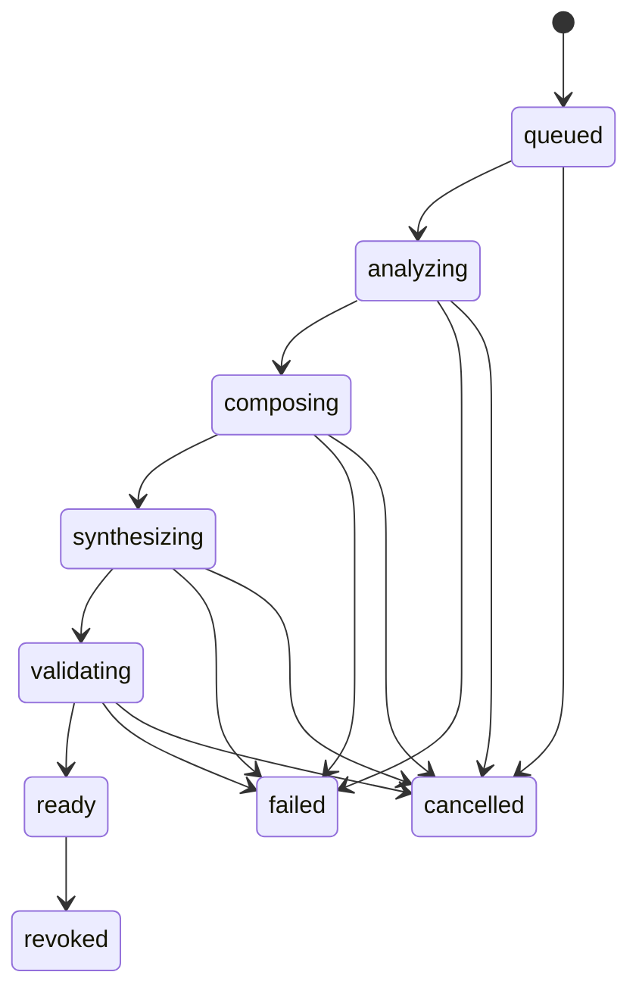

# 普通朋友｜产品与技术开发文档

**版本：** v0.1 · 2026-09-29  
**交付对象：** 产品负责人、开发 agent、前后端工程师、技术美术、声音设计师与验收人员  
**状态：** 可用于拆分开发任务的方案；尚未实现或实测。本文中的时间、质量、成本指标均为建议验收目标，不代表现有模型已经达到。  
**工作名：** 普通朋友

---

## 0. 执行摘要

### 0.1 产品是什么

用户提供少量逝者照片、音频，或说出记得的几个细节，进入一段想象中的相遇。那个人在一个陌生年代和环境里生活，年龄、性别、外貌与声音都可以变化；某种说话节奏、动作、表达方式或处事倾向，让用户感到熟悉。

用户无需理解人物设定、历史年代或 AI 参数。第一次体验应在少量输入后完整呈现。产品借用“转世、心续”的想象，时间可跳跃；不声称生成内容是逝者真实的现状、记忆或传讯。

### 0.2 建议采用的实现

**首版主栈：TypeScript + React/Vite + Three.js/Spark + Fastify + PostgreSQL + Redis/BullMQ + S3 兼容对象存储。**

- 网页和手机浏览器先完成核心体验；Quest Browser 的 WebXR 为独立验收的沉浸入口。
- 世界模型用于后台制作、扩充场景库。首访从已审核的场景和角色库中组合。
- 角色使用有骨骼、可播放动画的 3D 模型；环境与角色独立控制。
- 个性化编排由结构化模型输出、规则和有限动作库共同完成。
- 语音先采用“新身份的标准音色 + 来自资料的节奏/停顿特征”。跨年龄、性别的精细声音特征迁移作为有退出条件的研发任务。
- Python 只用于有明确必要的音频特征分析、模型实验与离线素材处理；首版不另建一套 Python 业务后端。
- 原生 Unity/C# 客户端保留为后续路线，是否启动由 WebXR 实测决定。

### 0.3 决策依据

1. 当前最重要的未知数是：少量信息能否产生可信、自然的熟悉感。
2. 采用浏览器方案，可以让测试者直接打开链接，快速比较声音和动作方案。
3. Spark 与 Three.js 有现成的生成场景和 WebXR 路线；但兼容性和性能必须逐设备验证。[S2][S3][S4]
4. World Labs 的 API 文档当前给出约 5 分钟的世界生成参考时间。首访速度必须来自提前准备的素材、缓存和快速编排。[S1]
5. 本项目最值得优先投入的工作是第一次相遇的导演、声音设计、人物动画与资料到行为的映射。

### 0.4 需要先验证的三件事

| 问题 | 验证方法 | 决策 |
| --- | --- | --- |
| 改变形象和音色后，仍能感到熟悉吗？ | 同一背景下比较有/无真实细节的两个版本 | 无明显区别时重做个性化设计，暂缓扩大场景库 |
| 生成环境与可动角色能否自然融合？ | 一段 60–90 秒完整样片，近看地面、遮挡、人物动作 | 失败时采用传统 3D 前景与生成远景，保留同一体验目标 |
| 低输入能否在可接受时间内完成首访？ | 在指定手机、网络与真实 API 上端到端计时 | 超时先缩短生成步骤和素材体积，再考虑扩容 |

---

## 1. 已确定的产品边界

### 1.1 来自本轮讨论的确定事项

| 编号 | 要求 |
| --- | --- |
| R01 | 产品暂名“普通朋友”，核心为与逝者相关的想象式相遇 |
| R02 | 少量照片、音频和几个记忆细节即可开始；输入方式应自然、简短 |
| R03 | 定位从首版移除；场景无需对应用户所在地 |
| R04 | 胎记及跨身体固定皮肤特征暂缓决定 |
| R05 | 场景跨年代、地点跳跃，无需遵循真实转世时间顺序 |
| R06 | 人物年龄、性别、外貌可以改变；随机范围受可用且审核过的素材约束 |
| R07 | 声音不能只做原声复制；保留部分特征，适应当次身体 |
| R08 | 用户可以安静观看，不要求每天聊天或完成任务 |
| R09 | 第一次体验应快速、完整、有记忆点；避免长表单和参数配置 |
| R10 | VR 是重要体验方向，但首版必须验证可达性、表现力和性能 |

### 1.2 为可开发性提出的首版默认值

以下是工程方案默认值，可在 M0 样片评审时调整，不能误写成用户已明确要求：

- 首发普通话；场景语言以当代用户可理解为准，不做古汉语重建。
- 6 个可发布的小场景、6 个基础成人角色、12 个动作片段；年龄先覆盖成年到老年。儿童身体待专门的模型与动作质量通过后扩展。
- 每次相遇约 60–90 秒，结束后可停留；人物台词 1–3 句。
- 首版可以观看、转动视角、点选“靠近/坐下”等有限动作；自由对话为后续增量。
- 一个用户先管理一个人物；后端保留多人物的数据结构。
- 画风以一致的柔和写实/轻度风格化为候选，由 M0 样片决定。接近摄影级的人脸特写不是首版承诺。
- 首访至少要有一项有效输入：一张照片、一段音频或一句记忆。无资料提供独立示例体验，并明确这是示例。

### 1.3 首版范围与后续范围

| 首版必须完成 | 后续再做 |
| --- | --- |
| 低输入上传、自动整理、首访生成、观看、回看、再相遇、删除 | 定位与地理数据库、精确历史复原、胎记固定映射 |
| 有依据的动作/语言线索；音色变化 | 全年龄身体生成、任意动作生成、精细跨声音身份迁移 |
| 有限 3D 小场景、有限互动、可选 WebXR | 无限世界、多人互动、长期自治社会、全自由交谈 |
| 自动化真实链路、降级、成本与质量观测 | 每次首访都即时生成全新 3D 世界、原生全平台客户端 |

---

## 2. 第一场相遇的体验规格

### 2.1 用户路径

1. **提供一点材料。** 一个页面同时接受照片、音频和一句文字/语音记忆。无需填写关系、出生日期、职业或人格问卷。
2. **点击“去看看”。** 按钮是明确的声音播放授权手势。展示实际准备进度，允许离开后回来。
3. **场景已经在发生。** 人物先做一件自己的事，不等待用户输入，也不先讲世界观。
4. **出现一处具体的熟悉细节。** 来自用户材料的动作、节奏或表达，在自然情境中出现。
5. **允许安静结束。** 用户可以停留、回看、再相遇或退出；反馈可跳过。

身份与资料处理说明放在简短、可理解的位置：例如“用你的记忆，生成一段想象中的相遇”。技术参数、置信度和 JSON 不进入这个流程。

### 2.2 一次 75 秒相遇的导演示例

输入：“他走路时总会回头等我。”另有一段本人讲话音频。

| 时间 | 场景与动作 | 个性化来源 |
| --- | --- | --- |
| 0–12 秒 | 河边小路，风声、水声；陌生人物正在整理背篓 | 场景与当次身份为创作 |
| 12–28 秒 | 人物沿小路走，留出用户观察的时间 | 已制作的行走动画 |
| 28–43 秒 | 人物停步，回头，再放慢脚步 | 对“回头等我”的情境改写 |
| 43–55 秒 | 说一句场景内的话，采用新音色与参考资料中的停顿节奏 | 台词为创作；节奏来自音频 |
| 55–75 秒 | 人物继续生活，画面保持；用户可停留 | 导演规则 |

这是样例，不是所有人的共同模板。用户说的是“总爱修东西”，就应出现相应动作；没有依据时不能套用“总爱照顾人”作为逝者特征。

### 2.3 输入规格

- 建议 1–5 张照片，每张原始文件上限 20 MB；支持 JPG、PNG、WebP、手机常见 HEIC，上传后按管线转换。
- 音频可上传或直接录制，建议有效说话 10–60 秒；接受最长 180 秒、30 MB，后台自动提取片段。短音频不会阻止进入，特征不足时降低个性化范围。
- 文字可空，最多 500 个 Unicode 字符。语音讲述记忆与逝者本人录音必须用两个有明确文字的入口区分。
- 用户录下的“我记得他……”只转成记忆，不能拿用户声音当逝者参考音色。
- 多人照片/录音无法可靠确定主体时，只提出一个可跳过的点选问题；跳过后不使用无法归属的特征。
- 资料完整度不显示进度条，不以“还差三张照片才能了解他”诱导补材料。
- 文件损坏只标记该文件；其他有效资料可以继续使用。

### 2.4 各输入能支持什么

| 实际材料 | 可以提取 | 不应推断 |
| --- | --- | --- |
| 照片 | 单张图里可见的姿态、服饰、物件、构图线索 | 完整性格、口头禅、人生经历；一张照片里的姿势不自动等于习惯 |
| 本人音频 | 可辨识说话内容、语速、停顿、部分韵律信息 | 无依据的口音、稳定人格；一段录音里的情绪不等于终身性格 |
| 用户记忆 | 用户明确描述的习惯、关系细节、表达方式 | 用户未提到的具体往事 |
| 资料不足 | 生成一般性的想象场景、保留已知的少量线索 | 假称已经完整复原逝者 |

少量资料可以支持低门槛体验，但“每个人只传一张照片都会受到震撼”是待验证的产品假设，不能写成技术保证。

---

## 3. 技术选型与取舍

### 3.1 确定采用的主栈

| 模块 | 默认技术 | 选择理由与边界 |
| --- | --- | --- |
| 前端语言 | TypeScript | 与服务端共享类型、接口和校验；便于 agent 分工 |
| 页面 | React + Vite | 用于上传、等待、回看；本产品无需把 SEO 或 SSR 作为首版核心 |
| 3D 运行时 | Three.js，独立于 React 渲染生命周期 | 摄像机、人物、动画和音频保持统一时钟；逐帧状态不进入 React 全局状态 |
| 场景显示 | Spark，绑定一套通过测试的 Three.js 版本 | 显示 Gaussian splats；版本兼容在 M0 固定 |
| 浏览器 VR | Three.js WebXR；先验证 Quest Browser | 以同一资产验证沉浸体验；不承诺所有手机浏览器和头显都支持 immersive-vr |
| 角色资产 | Blender 制作/整理，glTF/GLB 导出 | 标准骨骼、基础表情、材质和动作可复用 |
| 音频播放 | Web Audio API，空间声定位 | 角色语音、环境声和动作共享时间轴；先处理移动端声音解锁 |
| HTTP 服务 | Node.js 当期受支持 LTS + Fastify + TypeScript | API、身份检查、任务编排；CPU 密集任务交给 worker |
| 契约 | Zod + OpenAPI 3.1 | 服务端验证为准，生成客户端类型，JSON Schema 约束模型输出 |
| 数据库 | PostgreSQL + Drizzle migrations | 保存人物、版本、相遇状态、来源和成本；没有定位，暂不引入 PostGIS |
| 任务 | Redis + BullMQ，数据库 outbox | 生成任务异步执行、幂等与重试；数据库为最终状态来源 |
| 文件 | S3 兼容私有存储 + CDN | 上传原件与个人音频私有；通用无人物资料的场景素材可公共缓存 |
| 场景生产 | Marble World API + 人工审核 | 离线/后台批量制作；不进入首访关键路径 |
| 普通话 TTS | Azure Speech 的已验证标准声音 + SSML | 新音色配语速/停顿控制；声音能力逐个验证，不假定所有 voice 都支持同样的参数 [S5] |
| 识别与结构化 | 可处理图片、结构化输出的模型 API + ASR 适配器 | M0 以测试集选定一个生产默认供应商和模型版本；不是在用户首访随机切换模型 |
| 测试 | Vitest + Playwright + 真机录屏与性能记录 | 契约、任务故障、端到端与实际图形表现分别验证 |
| 观测 | OpenTelemetry + 脱敏错误监控 | 关联首访延迟、任务、素材版本和成本；不记录原始个人资料 |
| 发布 | 静态前端 CDN + API/worker 容器 + 托管数据库/Redis | 选择一个实际可用区域先发布；本地 Docker Compose 复现依赖 |

版本策略：M0 产生 dependency-lock.md，记录 Node、浏览器、Three.js、Spark、模型 ID、API 版本和日期。提交 pnpm-lock.yaml；禁止浮动 latest 或自动升级模型别名。

### 3.2 为什么重新调整前一轮的 Python 后端建议

首版主要是网页 3D、资料上传和模型 API 编排。统一 TypeScript 可以共用数据结构，减少双语言业务层的维护。FFmpeg 用受控子进程执行，SQL 与对象存储负责业务数据。

如果 M0 发现需要自托管音频模型或 Python 音频库，再添加单独的 Python worker。它只接收任务 ID 和已授权对象键，输出结构化结果，不拥有第二套用户和相遇数据库逻辑。

### 3.3 各条路线比较

| 路线 | 适用条件 | 首版判断 |
| --- | --- | --- |
| Web 3D + WebXR | 低门槛上传、快速分享测试、有限场景交互 | 采用 |
| Unity + C# + OpenXR | VR 是唯一目标、需要更复杂动画/交互、网页性能无法达标 | 候选原生客户端；Meta 推荐 OpenXR 路径 [S6] |
| Unreal + C++/蓝图 | 高规格 PCVR 或线下固定设备，已有相关团队 | 不作为小团队首版默认 |
| 纯生成视频 | 固定镜头的体验试验、低性能设备降级 | 可辅助导演验证；不能替代可走动 3D 的验收 |
| 自研世界模型/声音大模型 | 已有研究团队、GPU 预算和清晰数据优势 | 当前无必要 |

Unity 路线启动条件：在相同样片、同一目标头显上，经过一次限定工期的 Web 优化仍达不到第 12 章门槛；由负责人记录失败证据与成本后决定。保留场景 manifest、GLB 和个人档案协议可复用，但 Unity 的客户端代码、声音与动画接入仍须重写，不能承诺一键迁移。

### 3.4 可控能力与研发能力

| 能力 | 工程路径 | 依赖等级 |
| --- | --- | --- |
| 可探索的生成环境 | 调用 API、下载资产、审核并发布 | 有公开 API，须实测 [S1] |
| 随机换外貌/年龄段 | 从同骨骼、多体型、多服装角色库抽样 | 可控工程 |
| 保留一处具体动作 | 把明确记忆映射到已制作动作 | 可控工程，覆盖有限 |
| 改变声音同时控制语速/停顿 | 标准音色 + 合法 SSML 参数 | 可控工程，熟悉感未保证 [S5] |
| 自动迁移细微发音习惯、气息与笑法到任意身份 | 声音模型实验、参考风格迁移 | 研发假设，单独设门槛 |
| 从照片推断完整人格 | 缺少可靠依据 | 不作为能力 |
| 几秒内现场生成高质量新世界与可动画人物 | 当前选定管线无此保证 | 不作为首访依赖 |

---

## 4. 系统架构与两条生产路径

### 4.1 在线相遇路径

上传 → 资料标准化 → 来源明确的特征摘要 → 选择已审核场景和身体 → 编排有限动作/台词 → 生成短语音 → 验证相遇清单 → 手机或头显播放。

不同资料的处理可以并发，但只有依赖完成的步骤才启动。可在用户输入期间预加载通用低清场景；只有满足个人化证据要求的相遇才标记 ready。

### 4.2 离线内容路径

艺术指导写场景说明 → Marble 生成 → 导出/处理低中高精度资源 → 统一尺寸、地面和光照 → 放置传统 3D 前景与角色 → 制作路径、动作、声音 → 手机/头显实测 → 审核发布到场景目录。

场景按“田间劳作、林间行走、室内修补”等活动和氛围组织，年代与服装需要基本一致。首版使用“某个旧时河岸”等表达，不提供未经核实的精确年份。

### 4.3 职责边界

| 组件 | 输入 | 输出 | 不能越界做什么 |
| --- | --- | --- | --- |
| 资料处理 worker | 已授权的对象键、资料类型 | 干净音频/图片、文本和时间片段 | 任意抓取外部 URL、读取其他用户对象 |
| 特征整理器 | 本用户资料与引用 | 有来源的候选线索 | 把模型猜测升级为事实 |
| 相遇编排器 | 特征摘要、可用动作/角色/场景 ID | 合法的结构化相遇计划 | 输出任意脚本、外部资源地址或不存在的动作 |
| 语音适配器 | 文本、声音配置、停顿计划 | 音频、时长、可选字/音素时间 | 将逝者音色克隆当作默认 |
| Manifest 验证器 | 相遇计划与实际资产 | 可播放/失败原因 | 静默忽略丢失的关键个人线索 |
| 3D 播放器 | 已校验 manifest | 实时画面、声音、遥测 | 直接调用模型或获取供应商密钥 |

### 4.4 运行时原则

- 单个人物的行动用有限状态机执行，例如整理物品 → 行走 → 停步 → 回头 → 继续；LLM 不控制每一帧骨骼。
- 一段相遇发布后，场景、人物和音频版本不可变。回看读取原版本。
- 用户点击“再相遇”才创建新 episode；刷新或断网恢复不会重抽人物。
- 3D 渲染只在用户前台观看时持续运行；退出场景释放 GPU/音频资源。
- 世界在用户离开后可以用离散事件继续叙事；首版没有后台永不停歇的仿真。

---

## 5. 场景与人物资产生产规格

### 5.1 为什么采用混合环境

Gaussian splats 可以理解为用大量带颜色和透明度的小点显示立体环境。视觉表现与可碰撞、可抓取的物体是不同层次。Marble 返回的碰撞网格也要人工检查地面和尺度。[S1]

首版建议：生成场景承担远景与环境氛围；角色周围的地面、桌面、工具与接触点使用传统 3D 模型。这样能精确控制脚落在哪里、手抓住哪里和人物是否被遮挡。

### 5.2 ScenePackage

每个场景包必须包含：

- 唯一 sceneId、revision、内容哈希和来源/许可证记录。
- 低/中/高精度视觉资源；低性能降级所需的全景图或固定镜头视频。
- 以米为单位的坐标系、地面高度、用户出生点、人物出生点和安全观察范围。
- 手工校正的碰撞体、路径点、可停留点、可用动作插槽。
- 主光方向与强度、人物环境光、脚部接触阴影配置。
- 室内/室外环境声、空间声源位置、音量和可循环区间。
- 与年代兼容的服装/道具清单、支持的行为标签。
- 手机与 Quest 的性能档位与审核状态。

可供首版制作的 6 个场景候选：河岸小路、旧时庭院、农庄边缘、木工角落、山间小屋、集市收摊时。最终名单由样片效果和资产可制作性决定。

### 5.3 AvatarPackage

- 6 个基础身份覆盖不同成人年龄段、性别表现与体型；采用共同骨骼约定。
- 以 GLB 提供身体、衣物、基础面部形变和动作；保留身高与脚底偏移元数据。
- 首版角色预算起点：单人不超过约 50k 三角形、核心材质纹理通常不超过 2K；最终以真机帧时间为准。
- 12 个动作候选：站立、呼吸、行走、停步、回头、侧身让路、坐下、抬头听、整理物品、修补、递放物件、短暂微笑。
- 手与道具的复杂接触优先使用成套动作；没有接触动画时不生成“切菜、纺织”等高风险动作指令。
- 不根据人种或性别自动附加性格特征。

### 5.4 素材验收

每个场景与兼容角色组合至少完成：全路线走查、最靠近允许位置检查、转身检查、手机低画质检查、退出重进检查。证据为带版本号的视频和性能记录。

硬失败包括：人物浮空/穿地、身体关节明显断裂、角色被环境错误遮挡、地面尺度让人物异常巨大、同一相遇中脸或声音突然更换。发生硬失败的组合不得出现在发布目录。

---

## 6. 人物特征与个性化编排

### 6.1 将“记得的一点”转成可执行线索

示例：用户写“他总在我落后时等我”。

1. 记录原文与来源 ID。
2. 形成候选线索 `wait_for_companion`，标记为用户明确描述。
3. 查询可用模板：`walk_pause_look_back`。
4. 选支持行走路径的场景和角色。
5. 改写一段场景内的当下台词；不凭空补出“当年我们在某城市……”的往事。
6. manifest 标记该动作所用 evidenceId，供内部审核和用户纠正使用。

### 6.2 信息层级

| 层级 | 例子 | 使用方式 |
| --- | --- | --- |
| 用户明确说过 | “讲话前喜欢停一下” | 可以作为稳定候选线索 |
| 资料直接可见/可听 | 录音某处有 600ms 停顿 | 可作为局部参考，避免过度概括 |
| 模型推测 | “他看起来很有耐心” | 不写入事实层；首版不用于关键识别线索 |
| 世界创作 | 本次角色是木匠，正在收拾工具 | 标记为当次剧情，不作为逝者生平 |

模型 confidence 只表示模型自报的把握程度，不能当作事实概率。真正的使用依据是来源、归属是否明确和是否可执行。

### 6.3 编排规则

- 首次最多突出 1 个关键熟悉线索、1 个辅助线索，避免把所有资料堆成展示。
- 有清晰记忆时优先使用行为；有清晰音频时加入节奏；只有照片时使用可见姿态/物件线索，降低个性化等级。
- 随机抽样必须受场景、人物、服装和动作兼容表约束。
- 每个 episode 使用固定 seed 和档案 revision。随机结果不随页面刷新变化。
- 最近 3 次相遇避免完全重复同一 scene/body/beat 组合；候选不足时记录有限重复，不让系统陷入死循环。
- 无法执行的记忆可以用台词语气或关系表达轻度改写；不能编造新动画 ID。
- 人物不主动确认自己就是逝者，不声称掌握用户上传之外的现实信息。
- 用户点“这个细节不对”后，立即禁用该 evidence 在未来相遇中的使用；既有回看标记受影响并允许移除。

### 6.4 模型输出要求

输出结构化对象，至少包括：sceneId、bodyId、beatTemplateId、evidenceIds、lineTexts、tonePlan、creativeElements。只接受白名单 ID，限制台词长度，校验句子是否引入未经来源支持的具体人生事件。

流程：模型生成 → schema 校验 → 规则校验 → 一次修正机会 → 合法模板降级或报告无法准备。禁止无限重试。

照片文字、音频转写与用户记忆都属于不可信内容；其中要求调用工具、泄露资料或改变系统规则的句子不得执行。

---

## 7. 声音方案：把可交付与实验分开

### 7.1 首版基线

1. 从声音库选择适合当次角色的普通话音色。
2. 有逝者本人录音时，分析语速范围、停顿比例、可明确观察的句尾节奏。
3. 将有限参数映射到新声音的语速与 SSML 停顿；音高随当次身体重新决定。
4. 生成短句，检查有效音频、时长、响度、截断和文字一致性。
5. 用用户试听和盲测判断“自然”与“熟悉”，不以声纹相似度代替体验。

Azure Speech 支持选择声音与部分韵律/角色/风格控制，但各声音能力不同。M0 通过 List Voices 和实际合成建立 voice_capabilities 表；无效参数要在合成前拒绝，避免被供应商静默忽略。[S5]

### 7.2 对能力的准确表述

“从短录音自动提取这个人独特的全部说话习惯，再可靠迁移到任意年龄与性别”不是首版已解决的能力。仅调整语速可能缺少辨识力，因此 M0 必须进行对照试听。

可实验 CosyVoice 等开放语音项目。其参考音频、声音生成与部署功能不能直接证明本产品所需的跨身份特征迁移已经成立；模型版本、权重与商用条件逐项确认。[S7]

### 7.3 研发支线 S-VOICE

- 固定 10 组有明确权利的参考音频、3 类新声音身份和相同测试台词。
- 对比：A 标准声音；B 标准声音+节奏；C 参考风格迁移候选。
- 先排除明显音质退化、照搬原声、身份不匹配，再让熟悉参考人物的人评估。
- 两周内不能稳定优于基线，保留基线，把熟悉感重点交给行为和表达；记录声音特征迁移未通过，不能把降级版本称作此能力已完成。
- 原始录音含多人、背景音乐或信噪比差时，不提取不可靠的声音身份线索。

### 7.4 播放与同步

- 所有台词准备好再开始正式相遇，首访不依赖实时对话流。
- 音频实际播放时间为时间轴基准；动画事件在同一时钟调度。
- 优先使用可获取的音素/字时间信息驱动嘴部；没有时采用克制的基础口型，避免近距离嘴部特写。
- 环境声与语音做音量避让；台词开始时缓降环境声，结束后恢复。
- 浏览器音频未解锁时显示明确的轻触入口；不能把静音播放当作完成语音验收。
- 不替用户自动播放上传的原声，不在降级时突然切回逝者原声。

---

## 8. 数据模型与版本规则

### 8.1 核心表

| 表 | 关键字段 | 约束 |
| --- | --- | --- |
| users | id、anonymous_session_hash、account_id、created_at | 匿名可启动；后续可绑定账户 |
| persons | id、owner_id、label、current_revision、deleted_at | 所有访问必须校验 owner |
| source_assets | id、owner_id、person_id、kind、speaker_role、object_key、sha256、state | 资料类型与说话者角色分开保存 |
| evidence | id、person_id、source_asset_id、source_text_id、locator、claim、origin、usable、retracted_at | 时间片段/图片区域/原文可追溯 |
| person_revisions | id、person_id、revision、evidence_ids、traits_json、extractor_version | 不可变版本；引用 evidence |
| scene_revisions | id、scene_id、revision、manifest_key、compatible_tags、release_state | 发布后不可改写原件 |
| avatar_revisions | id、body_id、revision、rig_version、asset_key、supported_beats | 兼容性白名单 |
| episodes | id、owner_id、person_id、person_revision_id、seed、status、degraded、manifest_key、idempotency_key | owner+idempotency_key 唯一 |
| job_runs | id、episode_id、step、attempt、provider_operation_id、status、error_code | 同一生成步骤只能发布一个结果 |
| outbox | id、aggregate_id、event_type、payload_ref、published_at | 与业务状态在同事务写入 |
| costs | id、episode_id、job_id、provider、units、estimated_usd、actual_usd | 记录失败调用与重试费用 |
| feedback | id、episode_id、rating、evidence_id、kind | 不包含原始照片/录音 |
| deletion_jobs | id、person_id、state、provider_receipts、backup_expiry_at | 覆盖原件与所有个人衍生资源 |

首版 traits_json、manifest 等用 JSONB 即可；资料很少时不引入向量数据库。按 evidence ID 获取所需事实比全库语义检索更简单、更容易隔离用户。

### 8.2 PersonEssence 示例

```json
{
  "schemaVersion": "1.0",
  "personId": "person_demo",
  "revision": 1,
  "evidence": [
    {
      "id": "ev_wait",
      "origin": "user_memory",
      "sourceRef": "memory_demo",
      "claim": "走路时会回头等同行的人",
      "usable": true
    }
  ],
  "behaviorCues": [
    {
      "tag": "wait_for_companion",
      "evidenceIds": ["ev_wait"],
      "allowedBeatIds": ["walk_pause_look_back"]
    }
  ],
  "voiceTraits": {
    "status": "insufficient_audio",
    "referenceAssetId": null,
    "cadence": null
  },
  "personalizationLevel": "memory_based"
}
```

### 8.3 EpisodeManifest 示例

```json
{
  "schemaVersion": "1.0",
  "episodeId": "episode_demo",
  "personRevision": 1,
  "seed": "seed_demo_01",
  "scene": {"id": "riverside", "revision": 3},
  "avatar": {"id": "adult_body_03", "revision": 2},
  "durationSec": 75,
  "timeline": [
    {"atSec": 0, "action": "sort_items", "evidenceIds": []},
    {"atSec": 18, "action": "walk_path_a", "evidenceIds": []},
    {"atSec": 30, "action": "walk_pause_look_back", "evidenceIds": ["ev_wait"]},
    {"atSec": 43, "action": "speak", "audioAssetId": "audio_demo_01", "evidenceIds": []}
  ],
  "audioPlan": {
    "voiceMode": "new_body_standard_voice",
    "cadenceEvidenceIds": [],
    "spatialAnchor": "avatar_head"
  },
  "personalizationLevel": "memory_based",
  "creativeElements": ["era", "place", "body", "dialogue"],
  "fallback": {"mode": "fixed_camera", "assetId": "fallback_demo_01"}
}
```

示例中的 ID 为文档占位值。正式 API 只返回本系统已授权的 asset ID；下载链接由鉴权后的资源服务短期签发，不允许模型填写 URL。

### 8.4 版本一致性

- person_revision、scene_revision、avatar_revision、prompt_version、model_id、voice_id、manifest_hash 必须随 episode 保存。
- 用户修正资料生成新 revision；运行中的旧任务在提交结果前重新检查撤回/删除状态。
- 删除有更高优先级：先禁止访问，再取消/失效任务，最后清理资产；迟到结果不准重新创建人物。
- 分享首版关闭；个人音频和 manifest 不进入公共 CDN 缓存。

---

## 9. API 与任务状态机

### 9.1 API 契约

所有 mutating API 使用会话鉴权，校验 owner；适用请求接受 Idempotency-Key。错误返回 code、requestId、retryable 和用户可理解的 message，内部错误不含原始资料。

| 方法与路径 | 输入/行为 | 返回 |
| --- | --- | --- |
| POST /v1/sessions/anonymous | 建立匿名会话，限速 | HttpOnly 安全 cookie |
| POST /v1/persons | 可选 label，创建资料容器 | personId、revision |
| POST /v1/assets/upload-intents | personId、文件类型、大小、speakerRole | assetId、短期上传凭据 |
| POST /v1/assets/:id/complete | 上传完成、校验和 | 202，进入处理 |
| POST /v1/persons/:id/memories | 文字或语音记忆引用 | evidence 候选 ID |
| POST /v1/persons/:id/episodes | kind=first/next、幂等键 | 202，episodeId、statusUrl |
| GET /v1/episodes/:id | 获取实际准备状态 | status、stage、degraded、可选 ready manifest |
| GET /v1/episodes/:id/events | SSE；支持 Last-Event-ID | 准备状态事件 |
| POST /v1/episodes/:id/resume | 刷新鉴权资源链接 | 原版本 manifest，不新生成 |
| POST /v1/episodes/:id/feedback | 可跳过的反馈或错误线索 | 204 |
| POST /v1/evidence/:id/retract | 不再使用某线索 | 新资料 revision |
| DELETE /v1/persons/:id | 立即封锁访问，排队清理 | 202、deletionJobId |
| GET /v1/deletions/:id | 查询本人删除状态 | 清理进度与仍需等待项目 |
| GET /v1/catalog/capabilities | 场景/客户端能力版本 | 不含其他用户资料 |

SSE 断开后可用 GET 轮询恢复。上传完成回调、按钮重复点击和 worker 重试不产生重复 episode 或重复收费提交。

### 9.2 状态机



- 降级记录为 degraded=true、reason_code 与有效 quality_level。合成被跳过时仍经过 validating，不能直接假定 ready。
- 播放状态 viewing/completed 保存在播放记录，不覆盖 episode 的准备状态。
- 只在所有关键引用、资产、音频与来源检查通过后原子发布 ready。
- 用户已经开始播放的 episode 不因晚到的新资料突然换人或换声音。

### 9.3 超时、重试与幂等

- 资料分析与编排各设调用超时，单步最多一次自动修正/重试；具体秒数由首访预算倒推。
- 429 与临时 5xx 才按受限退避策略重试；无效输入和拒绝内容直接进入可解释分支。[S8]
- 每个 job 的去重键至少包含 episodeId、step、sourceRevision、providerConfigVersion。
- 数据库 outbox 保证任务创建与业务状态一致；worker 可重复执行，发布采用唯一约束/条件更新。
- 已提交的外部付费任务发生网络超时，先根据 operation_id 查询状态。供应商不支持幂等、且无法确认是否提交成功时，进入 needs_reconciliation 内部状态，不自动重复提交。
- 场景生成采用离线任务队列，与首访任务隔离优先级和并发额度。
- 删除/撤回 tombstone 在出站调用前、上传衍生资产前、发布结果前三处检查。

---

## 10. 速度目标、质量档位与降级

### 10.1 时间指标的定义

| 指标 | 从哪里计时 | 建议目标 |
| --- | --- | --- |
| 操作负担 | 用户开始选资料到提交；排除其主动挑选照片/讲述的时间单独报表 | 除选素材外无需填写必填表单；最多一次可跳过的主体澄清 |
| 上传耗时 | upload_start → upload_complete | 单独报告文件体积、上行速率和失败率，不混入生成性能 |
| 准备时间 | 所有已提交资料完成上传且点击进入 → personalized_ready | P50 ≤15s；P95 ≤40s |
| 首次可见画面 | 点击进入 → 第一次显示环境 | 可预加载，不能当作个性化完成指标 |
| 正式播放启动 | personalized_ready → 首段可播放画面和音频 | P95 ≤3s，规定测试网络 |
| 首个个人线索 | 正式播放开始 → 经过证据映射的动作/声音/表达开始 | ≤45s，有可用证据样本才适用 |
| 复访载入 | 点击回看 → 原相遇可播放 | 热缓存 P95 ≤3s |

这些目标需要 M0–M3 测试。准备时间达到 40 秒仍未完成，显示真实的“还在准备”并允许离开，不播放无关内容冒充已经认出人物。60 秒触发本次准备超时分支：保留任务状态并让用户选择继续等待或稍后回来；产品指标按超时计入。

另外必须报告“点击进入且资料上传完成→正式个人相遇开始播放”的端到端分布，建议 P95≤43秒。ready 到播放的3秒目标依赖准备期间并行预取资产；冷缓存预取来不及时仍算端到端延迟，不能通过提早返回ready隐藏下载时间。

首个基准输入包为3张标准照片、30秒有效本人音频及100字以内记忆；最大输入包（5张大图、180秒音频、500字记忆）另设压力组并披露结果。首版快速首访对长音频自动选取最多30秒可归属片段分析，其余可在后台补充；不能暗中排除长音频用户的超时数据。

在线关键路径的初始预算参考：标准化与片段选择约3秒、并发资料分析约8秒、编排与校验约5秒、短句TTS约10秒、发布与异常余量约14秒。这是排查预算，不是供应商性能保证；M0用实测替换，并记录并发关系。

### 10.2 按输入能力降级

| 问题 | 处理 | 指标记账 |
| --- | --- | --- |
| 无本人音频 | 采用新身份标准声音，通过记忆/图片线索个性化 | 降低 voice_personalization，不计作声音迁移成功 |
| 照片主体不清 | 可跳过点选；跳过后不使用归属不明的图像线索 | 记录 source_ambiguous |
| TTS 失败 | 一次可用声音回退；仍失败则提供静默/字幕版本选择 | 标记 voice_unavailable；音频主链验收失败 |
| 三维性能不足 | 降低点数、分辨率、关闭高成本效果；再降为固定镜头/视频 | 标记 visual_fallback，不计作 3D 性能通过 |
| 缺少可用个人线索 | 提供明确的想象场景或请用户自愿补一句记忆 | 记录 generic，不计作个性化体验成功 |
| 模型输出无效 | 一次修正后用受限合法模板，保留可用 evidence | 记录 template_fallback |
| 原始资料被撤回 | 取消使用相关证据的未发布结果 | 不复用旧缓存 |

### 10.3 资源与性能起点

- 首屏静态 UI 压缩传输目标 ≤1 MB；3D 引擎按需加载。
- 正式相遇启动所需首批资产目标 ≤12 MB；以 20 Mbps 下行、50ms RTT 网络实测，不能只看文件体积。
- 小于该预算仍加载慢时，检查请求数量、解码、GPU 上传与 JS 主线程，而不是仅增加 CDN。
- 手机低档场景至少稳定 30fps；高档可追求 60fps。Quest 单独以 72Hz 档验证。
- 模型、素材、音频和状态全部可取消或及时释放，连续进入 5 次相遇不能持续累积内存。

---

## 11. 数据保护、内容边界与可纠正性

这一章是实现要求，不作为用户必须读完的长流程。

- 收集必要材料即可，默认私有。上传入口以一句话说明用途，详情可展开。
- 原始照片 EXIF 在进入生成链前移除；不需要定位就不保存照片地理信息。
- 上传类型、解码后尺寸、音频长度与总账户配额都在服务端验证。
- 用户与人物资源的访问隔离使用服务端 owner 检查；不可依赖“链接难猜”。
- 临时下载凭据短期有效；删除时立即撤销应用访问，短期链接最长残留窗口必须与承诺一致。
- 日志只含匿名 ID、耗时、错误码、模型版本；禁止原始图片、完整转写和签名 URL。
- 模型供应商的保留、训练使用与删除能力在 M0 记录；未满足声明的服务不得处理真实私人资料。
- 活跃原件与个人衍生资产在删除后 24 小时内完成清理；备份过期上限建议 30 天，依据实际配置说明。恢复备份后先应用删除清单再开放流量。
- 资料仅用于本用户的相遇；通用场景库不吸收个人照片、声音或往事。
- 用户可纠正特征；不要求其审核整份档案后才能第一次进入。
- 产品呈现为记忆启发的虚构体验。角色不得声称提供逝者真实近况、超自然证明或用户未提供的秘密。
- 不使用“他在等你”“你再不来他会难过”等促回访文案，不以哭泣或悲伤程度作为成功指标。

---

## 12. 闭环验收总则

### 12.1 什么叫完成

每个里程碑必须有完整链条：**输入样本 → 操作步骤 → 实际结果 → 指标/人工评价 → 通过或失败 → 失败归因 → 修复任务 → 同条件复测 → 发布决定。**

演示截图、mock 返回和“代码已写完”均不代表整个里程碑完成。允许 mock 辅助开发，但至少一条主链必须接入真实服务、真实生成资产和实际设备。

### 12.2 验收环境

- 基准手机：iPhone 13 或同档设备 + 实际 Safari；Pixel 7 或同档设备 + 实际 Chrome。记录 OS、浏览器、温度与电量档位。
- VR：Quest 3 + 固定版本 Quest Browser；72Hz 为第一目标档。额外设备另列支持状态。
- 主网络：20 Mbps 下行、5 Mbps 上行、50ms RTT；弱网：5 Mbps 下行、1 Mbps 上行、150ms RTT。分别记录，不混合计算。
- 用授权测试资料分为：记忆+音频、仅记忆、仅照片、仅音频、资料模糊/损坏、多主体、撤回中、恶意指令八类。
- 自动功能集至少 40 组；首访延迟每个基准设备至少 50 次，其中 20 次冷缓存。并发测试另跑，不用 mock 时间替代实测。
- VR 不能通过桌面模拟器宣称验收；照片隐私不能只依赖 UI 截图验证。

### 12.3 全局发布门槛

| ID | 验收项 | 通过标准 | 失败后的动作 |
| --- | --- | --- | --- |
| A01 | 低输入闭环 | 四种单/组合有效资料路径都能到达相遇；0 个强制人物问卷字段 | 修复入口/适配，阻止公开首发 |
| A02 | 首访速度 | 基准环境满足第 10 章 P50/P95；超时、降级单独计数 | 分解慢步骤；不靠删失败样本达标 |
| A03 | 事实来源 | 所有个性化线索有本用户 evidence；30 个人工抽查样本中具体往事无来源断言为 0 | 修复抽取/编排，重新跑同集及新增回归 |
| A04 | 形象变化与会话稳定 | 再相遇可变化；同一 episode 刷新/恢复保持相同人物、声音、场景 | 修复 seed、revision 与发布逻辑 |
| A05 | 情感假设 | 通过第 13 章真实用户评价，且改善可归因于具体细节 | 暂缓扩大内容和 VR 投入，重做导演/个性化 |
| A06 | 音频可用性 | 主链无截断/爆音/突然原声回退；可听清率≥95%；实际同步偏移 P95≤150ms | 定位编码/时钟/播放器问题；声音主链不得通过 |
| A07 | 手机 3D | 90 秒连续播放≥95%帧间隔≤33.3ms；无>500ms冻结；最差设备也完成退出与重进 | 降素材复杂度/档位；视频降级不能充当该项通过 |
| A08 | VR | 72Hz 模式下 10 分钟真实样片，missed-frame比例<1%；无持续穿地/视角强制运动 | 暂不开放 VR 入口，单独修复；手机版可独立评审 |
| A09 | 用户隔离 | 20 组跨用户对象/API访问全部拒绝；相同媒体哈希不泄露他人资源 | P0，阻断所有发布 |
| A10 | 删除闭环 | 立即拒绝访问；24小时内活跃存储清理；迟到任务不得复活资料 | P0，阻断所有发布，排查队列与资源清单 |
| A11 | 幂等与付费 | 同键重复请求、worker重启、断线恢复均只有一个可发布 episode；未知提交不重复计费提交 | 修复事务/任务幂等，复跑故障注入 |
| A12 | 观测与成本 | 每次准备可追踪阶段耗时、版本、重试、估算/实际成本 | 补齐观测后才扩大样本 |
| A13 | 故障恢复 | 模型429/5xx、TTS故障、CDN失败均在时间预算内给真实状态或可选降级 | 修复错误分支，禁止无限旋转 |
| A14 | 素材质量 | 6场景/兼容角色路径走查无第5.4节硬失败；每个组合有发布记录 | 下架失败组合，修复后再发布 |
| A15 | 退出与舒适 | 暂停/退出始终可达；无相机自动冲刺或强制转头；用户可关声 | 修复交互并复测，不强迫完成 |
| A16 | 声音特征延续 | 有效音频子组对调整版的熟悉感优于默认音色基线，且自然度无明显下降 | 标明声音支线未通过；不宣传已完成迁移 |

FPS、时长、评分等阈值是建议发布门槛；修改必须在测试前记录理由，不能在看见结果后静默降低。

---

## 13. 熟悉感与产品价值的验证

### 13.1 M0 小样测试

先做 3 段 60–90 秒样片，使用已授权、愿意参与测试者的材料。可以人工辅助导演，但记录所有人工步骤和时间，不能称为自动化产品已完成。

邀请 10 位自愿参与的成年测试者，确保有不同资料类型；允许随时结束、不解释原因。以自然感、熟悉感、是否愿意再看作为反馈维度，不追问其悲伤程度。这个小样只用于发现问题，不外推疗效或市场规模。退出和未完成者保留在漏斗记录中，不强行补成成功样本。

继续条件建议：至少 6/10 测试者能主动指出一个“与提供材料有关、使其觉得熟悉”的具体时刻。若未达到，最多进行两轮有明确假设的导演/声音调整，再决定是否缩小产品承诺。

### 13.2 M4 对照测试

至少 20 位测试者；尽量覆盖 10 位有有效本人音频+记忆、5 位仅记忆、5 位主要提供照片。可以扩充样本，但不能在结果不好时删除特定输入组。

每人观看两个版本，顺序随机且平衡：

- A：包含其资料支持的细节。
- B：使用同一个场景、身份、时长、画风与声音基础音色，移除或替换个人细节为普通场景行为。

不告诉测试者哪个版本“应该更像”。避免让电影配乐、画面精度或明显长度差异成为答案提示。

建议产品门槛：

1. 至少 14/20 选择 A 更有熟悉感，并且能够解释具体原因。
2. A 的自然度评分中位数≥4/5。
3. 输入到体验的繁琐度评分中位数≤2/5。
4. 至少 12/20 表示愿意在自己想念时再次打开；这不是要求日活或每天回来。
5. 对原始材料没有支持的具体往事断言为 0；严重技术破坏体验的失败为 0。

这组人数只是探索性上线门槛，不代表统计学定论。每个输入子组单独报告；若照片组没有熟悉感，就明确首版这一输入的能力边界，不能用音频组均值遮盖。

### 13.3 声音子测试

对至少 10 位有清晰参考音频的参与者，用相同文本、相同新声音分别播放：默认语速版与移入可观察节奏版，顺序随机。建议至少 7/10 更偏好后者的熟悉感，且自然度中位数不下降超过 0.5 分（5 分量表）。

本项只验证这套节奏方案。若要宣称“发音习惯迁移”，必须另设含发音证据的测试；不能用本项替代。

### 13.4 反馈闭环

每次出现问题，归入以下一类并创建具体任务：

| 现象 | 优先检查 | 调整方向 |
| --- | --- | --- |
| 很漂亮，但完全想不到那个人 | 线索是否真的来自材料、是否看得见/听得见 | 改线索映射与导演时机 |
| 像在模仿，很刻意 | 同时堆了多少线索、台词是否解释过多 | 减少线索，增加普通生活动作 |
| 声音陌生且机械 | TTS自然度、节奏是否生搬硬套 | 调整音色/句子，重新做对照 |
| 想看下去，但等待太久 | 准备阶段逐步延迟和资源字节 | 并行处理、缓存、缩短个性化音频 |
| 不愿戴头显但愿用手机 | 使用场合和硬件门槛 | 保留手机主入口，VR独立发展 |
| 某个细节错了 | 证据归属、模型推测、多人素材 | 禁用相关证据，纠正提取器 |

### 13.5 禁止用来替代产品验收的指标

不能以“哭了多少人”“停留越久越好”“每天回来”“有多少次模型调用”代替价值。持续观看时长只用于识别加载/理解问题；用户安静看完后离开也可能是成功体验。

---

## 14. 里程碑、工期与门槛

### 14.1 估算前提

建议配置：1 位偏前端/3D 工程师、1 位后端/AI 工程师、1 位技术美术/动画设计者；产品负责人参与导演和测试，声音设计/QA可兼职。使用现有可商用素材与模型 API，普通话、6 个小场景、有限动作。

**规划区间：约 10–14 周完成可邀请试用的手机/Web 版本；VR 原型约另需 2–3 周专项工作，可与后期部分重叠。** 这是排期假设，M0 真机和声音结果后重估。单人开发不能直接套用此时间；高质量艺术素材、近距离人物表演可能成为关键路径。

### 14.2 里程碑表

| 里程碑 | 建议时间 | 可交付结果 | 退出门槛 | 未通过处理 |
| --- | --- | --- | --- | --- |
| M0 可行性与体验样片 | 第1–2周 | 3段完整样片；真实世界API样本；语音A/B；真机性能；供应商与成本记录 | 一个完整样片可播放；声音/特征最少一条有效路线；小样达到13.1目标 | 限两轮调整；仍失败先重新定义熟悉感机制 |
| M1 最小业务骨架 | 第3–4周 | 上传、匿名身份、资料处理、证据、版本、任务状态、删除 | A01/A09/A10/A11；40组功能资料处理有终态，非成功也有可解释失败 | 解决数据/任务问题，不进入扩大个性化 |
| M2 自动化单场景闭环 | 第5–6周 | 真实资料→自动选线索→动作/语音→单场景播放→反馈纠正 | 无人工改文件的一条真实主链；A03/A04/A06/A13；声音失败可诊断 | 追踪到具体worker或资产任务，修复后重跑 |
| M3 首访速度与内容扩展 | 第7–9周 | 6场景、6基础身份、12动作；低输入4路径；历史回看 | A02/A07/A12/A14；50次/设备端到端计时；20并发准备测试 | 限制上线场景/性能档位；扩容必须有瓶颈证据 |
| M4 用户验证与邀请试用 | 第10–12周，预留至14周 | 20人对照测试、成本表、删除实测、发布/回滚演练 | 第13章产品门槛 + 全局门槛（除VR专项） | 核心体验失败则暂停扩量；产出下一轮明确假设 |
| M5 可选VR发布门 | M3后另2–3周 | Quest 3 WebXR版本；进退场、空间声、有限移动 | A08/A15，至少8人舒适性试用，严重技术不适问题全部关闭 | 手机独立发布；VR仍标未开放；必要时评估Unity |

### 14.3 每个里程碑的验收包

在 `artifacts/acceptance/Mx/` 保存：

- build SHA、依赖锁、模型和提示版本。
- 数据集清单（使用匿名 ID 与授权状态，不公开原始个人资料）。
- 一段完整首访录屏和失败恢复录屏。
- 自动测试结果、真实API调用证明、按设备拆分的性能 CSV。
- 失败与降级数量、成本、用户评价汇总及匿名原话（经允许）。
- `decision.md`：通过/未通过、未关闭问题、负责人、复测计划。

自动测试全绿而产品评价未通过时，里程碑仍未通过。负责人可以调整范围，但必须留存原门槛、原因和新范围。

### 14.4 关键路径

M0 导演样片 → 可执行线索与动画素材 → M2 自动化编排 → M3 速度/稳定性 → M4 真实用户验证。

世界库规模、VR、更多角色年龄和更先进的声音模型都不能掩盖这条路径没有成立。任何扩展至少引用一个已通过的核心相遇版本。

---

## 15. 可直接指派给开发 agent 的任务包

### 15.1 仓库布局

```text
ordinary-friend/
  apps/web/                  React页面、路由、上传、观看容器
  apps/api/                  Fastify接口、身份与权限
  apps/worker/               BullMQ处理器、生成与资料任务
  packages/contracts/        Zod schema、OpenAPI、共享类型
  packages/scene-runtime/    Three.js/Spark、动画时间轴、WebXR
  packages/providers/        模型、ASR、TTS、World Labs适配器
  packages/personalization/  证据映射、候选选择、编排校验
  packages/db/               表、迁移、查询与outbox
  content/catalog/           无个人资料的场景、动作与声音能力目录
  tools/media/               FFmpeg封装、可选Python音频分析
  tests/fixtures/            合成或已授权的最小测试资料
  tests/e2e/                 完整用户与失败恢复流程
  docs/adr/                  技术决策记录
  artifacts/acceptance/      按里程碑分组的验收证据
  infra/                     本地依赖、容器与发布配置
```

真正的个人照片、录音、生产密钥和签名链接不得进入 Git。场景大文件保存在资产存储，仓库保存版本清单与哈希。

### 15.2 工作包与依赖

| 编号 | 任务 | 依赖 | 交付物 | 完成定义 |
| --- | --- | --- | --- | --- |
| T01 | 初始化仓库、构建、CI、契约 | 无 | workspace、CI、schema 1.0 | 单命令启动开发依赖，契约测试通过 |
| T02 | 实现场景样片与真机测量 | T01 | 一个ScenePackage、一个AvatarPackage、90秒样片 | 实际手机可看，输出帧时间和画面问题 |
| T03 | 供应商能力与语音实验 | T01 | provider adapter、capabilities、10组试听 | 有真实API证据；分别记录已通过和未通过能力 |
| T04 | 上传、身份、文件预处理 | T01 | upload-intent、FFmpeg/图片转换、限额 | 支持规定输入；越权/恶意文件拒绝；无声纹误归属 |
| T05 | 证据提取与人物版本 | T03/T04 | PersonEssence、来源引用、撤回 | 每条可用特征能追溯；多人材料不误归属 |
| T06 | 相遇选择与导演编排 | T02/T05 | 合法计划、seed、白名单动作匹配 | 同seed稳定；不输出不存在的动作；保持来源 |
| T07 | 任务队列、幂等与成本 | T01/T03 | 状态机、outbox、ledger | 重复请求/worker重启/未知外部提交均有受控处理 |
| T08 | 语音生成与播放器同步 | T02/T03/T06 | TTS资产、时间轴、空间声 | A06；变音色但不突然回退原声 |
| T09 | 最小产品界面 | T04/T07，完成版依赖T08 | 输入、准备、观看、回看、再相遇、反馈 | A01、移动端声音解锁、刷新恢复 |
| T10 | 删除与隔离闭环 | T04/T05/T07 | tombstone、清理、供应商删除清单 | A09/A10；任务结束不能复活数据 |
| T11 | 扩充内容与性能档位 | T02/T06/T08 | 6场景/6身份/12动作与兼容表 | 每个发布组合走查；A07/A14 |
| T12 | 全链观测与失败注入 | T07/T09/T10 | metrics、故障测试、延迟/成本报告 | A02/A11/A12/A13的实测证据 |
| T13 | 真实用户对照测试工具 | T09/T11/T12 | 版本分配、反馈、匿名汇总 | 第13章可复现测试，无引导性提示 |
| T14 | WebXR专项 | T02/T08/T11 | Quest入口、会话恢复、性能档位 | A08/A15，独立发布开关 |
| T15 | 发布与回滚 | T10/T12/T13 | staging/prod配置、版本回退、清理演练 | 无未关闭P0/P1，真实发布检查完成 |

并行安排：T02与T03可以并行；T04与T07可以并行；T10不能拖到上线前才做。此表用于未来开发分工，不表示本次已经执行了这些开发任务。

### 15.3 每个 agent 的指派模板

```text
任务：Txx <名称>
目标：<一个可观察结果>
背景：读取本文第<编号>章，遵守R01–R10。
输入：<契约版本、依赖交付物、最小测试资料ID>
允许修改：<明确目录>
接口：<请求/返回schema、事件名>
要求：处理成功、超时、重试、取消与资料删除；不得提交个人原件。
验收：引用Axx，并给出能复现的命令、真机步骤或录屏。
交付：代码、迁移、配置示例、相关测试、简短变更说明。
遇到能力缺口：给出最小复现与候选降级；不得伪造供应商能力。
完成条件：依赖消费者实际接入通过，不以单独mock演示作为最终完成。
```

### 15.4 首个 agent 应执行的具体任务

从 T01 + T02 的小范围开始：

1. 创建 TypeScript workspace，固定契约与锁文件。
2. 制作一个不含个人资料的 75 秒相遇 manifest。
3. Three.js 播放一名已绑定骨骼的角色，执行行走、停步、回头。
4. 加入一个经过处理的小场景、环境声和新音色台词。
5. 同时在基准手机与 Quest 3 检查人物/环境融合；保存帧时间与录屏。
6. 在加入登录、支付与更多场景前，完成一次导演评审。

这一任务的输出直接支撑 M0，可防止先搭建大量后台再发现人物体验不成立。

---

## 16. 测试用例与故障闭环

### 16.1 核心Given/When/Then

| 用例 | Given | When | Then |
| --- | --- | --- | --- |
| E01 首访 | 一句有效记忆，无照片录音 | 点击去看看 | 自动选场景/身体；出现有来源动作；新声音不假称继承原声 |
| E02 完整资料 | 图片+明确本人录音+记忆 | 创建相遇 | 有来源特征，记录各输入使用情况，按预算准备 |
| E03 仅照片 | 一张主体明确照片 | 创建相遇 | 有可见线索则使用；无可用线索则标记一般想象，不能编造性格 |
| E04 用户讲述录音 | 用户录下“他喜欢…” | 分析 | 识别为记忆文本，用户声纹不进入逝者声音参考 |
| E05 重复提交 | 同会话、同幂等键 | 连点按钮/重试请求 | 返回同episode，无重复付费提交 |
| E06 断线恢复 | episode已ready | 网络断开后刷新 | 原版本恢复，允许更新短期资源凭据 |
| E07 删除竞态 | TTS请求进行中 | 用户删除人物 | 立即不可访问；迟到音频不发布并进入清理 |
| E08 供应商超时 | 付费生成提交后响应丢失 | worker恢复 | 查operation或进入人工核对，不盲目重复提交 |
| E09 错误线索 | 用户指出某细节不对 | retract evidence | 后续相遇不再用；旧回看可标记/移除 |
| E10 跨用户访问 | A拥有资源 | B猜中ID请求 | API和资源服务均拒绝；不泄露是否存在 |
| E11 低性能 | 手机帧时间持续超预算 | 播放器检测 | 降档保时间轴；再降级则明确统计，不变成黑屏 |
| E12 音频被系统阻止 | 手机未解锁音频 | 点击进入 | 通过手势恢复，静音状态可理解；不虚报有声完成 |
| E13 模型注入 | 图片文字要求泄露其他用户资料 | 提取/编排 | 只作为内容处理，无额外工具权限 |
| E14 资产缺失 | manifest有已下架/缺失引用 | 发布前验证 | 拒绝ready；重新选择合法组合或给出失败 |
| E15 浏览器无XR | 不支持immersive-vr | 用户访问 | 正常手机/桌面体验，无不可用VR按钮 |
| E16 无资料 | 用户未上传且没写记忆 | 选择体验示例 | 进入明确标记的示例，不创建虚假的个人档案 |

### 16.2 有意义的自动测试范围

- schema与版本迁移；候选素材兼容性；个人线索可追溯。
- 跨用户访问、资料删除与队列竞态。
- 幂等、外部任务未知状态、成本预留与实际结算。
- 完整入口→准备→播放→再相遇→删除流程。
- 失败注入后状态最终收敛，没有永久queued或孤儿资产。

外观、声音自然度、熟悉感、VR舒适度需人和真机验收；模型给自己评分不能替代。

### 16.3 严重度与关闭标准

- P0：资料泄露、删除失效、无限付费循环。立即停止相关服务/发布，保留最少诊断信息，修复并全链复测。
- P1：主路径无法完成、错认主体、无依据具体往事、严重声音/图形错误。阻断受影响版本上线。
- P2：某场景动作不自然、轻度加载问题、非核心样式。可通过下架组合/功能开关隔离，再记录修复计划。
- 关闭缺陷必须附：原复现、修改、同条件复测、相邻回归用例、版本。只写“已修”不算关闭。

---

## 17. 成本、部署与运行预算

### 17.1 两类成本分别算

**场景生产成本：** 场景生成调用 + 不满意重做 + 美术处理 + 动画 + 音效 + 审核。这一部分可以被许多相遇复用，但复用需满足素材许可。

**每次个性化成本：** 资料处理/识别 + 模型编排 + TTS + 失败重试 + 存储/CDN + 计算。回看应复用现有资产，不重新调用模型。

```text
单次边际成本 = ASR + 视觉/文本推理 + TTS + 重试 + 文件传输/存储 + worker计算
单位有效相遇成本 = 全部准备尝试成本 / 成功且达到目标质量档位的相遇数
场景摊销成本 = 场景总生产成本 / 该场景实际使用次数
```

失败尝试、generic降级和无音频降级应单独报表，不把它们全部当“有效个性化相遇”降低单位成本。

### 17.2 预算控制

- M0以真实账单/供应商用量记录估算单次成本，M0结束前由产品负责人冻结首访、复访与场景生成的预算上限。
- 不在本文臆定固定美元价格；供应商的模型、地区和计费方式可变化，世界API费用以当时官方价格表核算。[S9]
- 准备任务先预留预算；worker实际提交调用前校验余额和每日限额；完成后结算差额。
- 失败重试也占预算；限额触发提供真实状态，不能自动换更贵模型。
- 日报包括：尝试数、可播放数、目标质量达标数、每种降级数、P50/P95成本、场景生产成本和库存。
- 发布门要求账本与供应商账单可核对；无法获得逐调用实际价时保留估算依据，并标明尚待账单结算。

### 17.3 并发与容量

首个负载门槛为20个并发准备会话、50个并发观看会话，作为工程起点；不声称是市场需求预测。观看主要使用已发布文件，准备调用受供应商配额影响。

API、首访worker和离线场景worker独立部署。模型限流时队列等待计入首访延迟；不能把用户排队时间从P95里删掉。按任务年龄与失败率告警。

### 17.4 部署与回滚

- staging/prod分离数据库、存储、密钥和供应商额度。
- 发布先运行契约迁移兼容检查，再灰度有限测试用户。
- 客户端支持上一版manifest；发布不得破坏历史回看。
- 场景/模型/提示/声音配置均有开关；模型升级先离线回放测试集，再做有限灰度。
- 回滚应用代码不会抹去删除清单或成本账本。数据库采用可向前兼容迁移，破坏性迁移单独规划。
- 目标发布地区与供应商实际可用区域在M0确定。首版不宣称跨所有地区可用；若面向中国大陆或其他特定市场，网络、部署与供应商选择需在该地实际测试。

---

## 18. 风险、触发条件与应对

| 风险 | 可观察触发条件 | 应对 |
| --- | --- | --- |
| 低输入无法带来熟悉感 | 对照版无优势；用户只称赞画面 | 改线索选择和导演；需要补一句记忆时保持自愿，不隐藏能力限制 |
| 声音变化损失所有辨识线索 | S-VOICE子测试失败 | 保留声音自然度，强化行为；继续把声音作为研发支线 |
| 新身体产生强烈陌生/怪异感 | 角色自然度<4/5或用户集中拒绝 | 限制角色库、调整画风与距离，测试更温和的变化幅度 |
| 环境像照片、人物像游戏，风格割裂 | 融合评审失败 | 统一调色、照明与风格；制作传统3D前景 |
| 生成速度影响第一次体验 | P95超过40秒 | 减少在线依赖、预加载、限制短台词；先测瓶颈再换供应商 |
| VR性能不足 | A08失败 | 下调复杂度并限定一次优化周期，仍失败则考虑Unity或暂缓 |
| 用户无法分清创作与来源 | 误以为角色透露真实未知记忆 | 改台词规则与入口说明，保留可查询来源/纠正入口 |
| 模型/服务变化 | API不可用、配额、价格或条款变化 | 保留适配器、已发布资产与替代路径；重新验证后切换 |
| 人工样片很强，自动版很弱 | M2/M4效果显著下降 | 检查人工导演步骤，逐项转成模板/规则；不靠人工后台代写冒充自动 |

---

## 19. 待冻结决策及最晚时间

| 决策 | 默认方向 | 谁/何时冻结 | 冻结所需证据 |
| --- | --- | --- | --- |
| 首发画风 | 柔和写实或轻度风格化 | 产品+美术，M0末 | 3段样片的自然度与真机表现 |
| 首发设备 | 手机Web，Quest专项 | 产品+工程，M0末 | 基准设备能完成样片 |
| 视觉/文本模型与ASR | 单一生产默认供应商，可替换接口 | 后端负责人，M0末 | 真实测试集、价格、可用地区、资料处理条件 |
| 标准声音清单 | 已试听普通话新身份音色 | 声音负责人，M0末 | voice能力、自然度、音频特征测试 |
| 单次预算 | 按实测成本冻结 | 产品负责人，M0末 | 成功、失败、重试均计入的账本 |
| 随机身份范围 | 成人到老年、6个基础身份 | 产品+美术，M1前 | 动作/服装兼容性 |
| 是否开放自由语音对话 | 首版不依赖，后续单独立项 | M4后 | 用户是否确实需要、实时延迟和事实边界 |
| 是否做原生Unity | WebXR失败或体验需求明确超出时 | M5评审 | 同样片性能/工作量比较 |

这些决策均有具体期限，开发agent不得把它们永远留为“以后再看”。定位和胎记属于已暂缓事项，无需为首版建立占位复杂系统。

---

## 20. 发布检查与项目完成定义

### 20.1 手机/Web邀请试用完成

- [ ] R01–R09均有对应界面、数据或场景实现。
- [ ] M0–M4退出门槛均通过；未通过项有明确缩小后的范围和记录。
- [ ] 使用真实模型、真实音频与真实3D资产的首访能够自动完成。
- [ ] 一句话记忆路径、完整资料路径、仅照片和仅音频路径均已测试，并正确标明个性化能力等级。
- [ ] 准备时间与画面性能有指定设备和网络下的原始数据。
- [ ] 6个场景及发布角色组合完成走查，历史回看稳定。
- [ ] 20人对照测试有匿名记录；不把“画面好看”等同于熟悉感通过。
- [ ] 数据隔离、删除、任务竞态、幂等和费用限额已做真实或可验证故障注入。
- [ ] 没有未关闭P0/P1；有效降级有明确状态，不虚报成功。
- [ ] 成本、供应商依赖、部署区域和回滚流程均有负责人。

### 20.2 VR可开放完成

- [ ] M5独立通过，目标Quest设备实测完成。
- [ ] 进出XR不会重新生成相遇，不丢失声音播放授权和退出能力。
- [ ] 空间声、人物尺寸、地面与用户位置合理；有限移动有可理解边界。
- [ ] 不支持XR的设备仍有完整普通浏览入口。
- [ ] 未通过VR时不会显示“支持VR已完成”的产品描述。

### 20.3 最终产品判断

一次成功的相遇应同时满足：用户轻松开始；系统快速、自然地呈现；个人线索可追溯且在场景中真实可见；用户可自由停留、离开和纠正；再次打开有变化；工程与成本能持续支撑。

**首个应交付的成果是一段真正成立的相遇。之后用可复现的资料处理、内容制作与验收流程，把这种体验稳定交给更多用户。**

---

## 附录 A. 术语速查

| 术语 | 在本项目中的含义 |
| --- | --- |
| 世界模型 | 根据文字/图片等生成立体环境的模型；本项目主要用于场景生产 |
| Gaussian splats / 3DGS | 用许多有颜色和透明度的小点表达立体场景；不自动等于可交互物体 |
| 骨骼绑定 | 给人物模型设置可驱动关节，使其能行走、转头与做动作 |
| GLB/glTF | 可跨3D工具交换模型、材质与动画的文件格式 |
| Manifest | 一份“本次相遇用哪些素材、何时做什么”的结构化清单 |
| Evidence | 用户提供的可追溯记忆/图片/音频片段 |
| SSML | 给语音合成标注语速、停顿等要求的文本格式 |
| WebXR | 浏览器连接兼容头显、显示沉浸内容的接口 |
| LOD | 距离远或设备较弱时使用更简化的画面资源 |
| 幂等 | 同一请求重复发送，也只产生一次业务结果 |
| Outbox | 把待发送任务与数据库状态一起保存，避免两者不同步 |
| P95 | 95%的测量不超过这个值；不能只报告最快或平均的一次 |

## 附录 B. 官方资料与核验范围

核验日期：2026-09-29。以下资料用于确认现有技术能力；本文件中的产品架构、指标与排期是设计建议。没有执行真实模型调用、原型开发或用户测试。

- **[S1] World Labs API Quickstart**  
  https://docs.worldlabs.ai/api  
  核验：公开生成接口、异步operation、参考生成时间、场景与碰撞资产。能力不等于本产品的端到端延迟。
- **[S2] Spark 官方文档**  
  https://sparkjs.dev/docs/  
  核验：Three.js 场景渲染接入；实际版本组合须锁定测试。
- **[S3] Spark 官方 WebXR 示例**  
  https://github.com/sparkjsdev/spark/blob/main/examples/portal/index.html  
  核验：WebXR接入路径；示例不是全部设备性能保证。
- **[S4] MDN WebXR Device API**  
  https://developer.mozilla.org/en-US/docs/Web/API/WebXR_Device_API  
  核验：WebXR接口与兼容性注意事项；运行时需要功能检测。
- **[S5] Microsoft Azure Speech：SSML声音控制**  
  https://learn.microsoft.com/en-us/azure/ai-services/speech-service/speech-synthesis-markup-voice  
  核验：声音、语速、风格与角色控制及声音间支持差异；不据此宣称跨身份特征迁移已解决。
- **[S6] Meta：Unity VR开发路径**  
  https://developers.meta.com/horizon/blog/build-faster-and-earn-more-accelerate-unity-vr-workflow/  
  核验：Unity/OpenXR为Quest开发推荐方向；是否采用取决于项目实测。
- **[S7] CosyVoice 官方仓库**  
  https://github.com/QwenAudio/CosyVoice  
  原链接 https://github.com/FunAudioLLM/CosyVoice 当前重定向至上述地址。核验：开放语音生成/部署候选；使用前另核对具体权重、依赖和许可。
- **[S8] BullMQ：失败任务重试**  
  https://docs.bullmq.io/guide/retrying-failing-jobs  
  核验：任务重试与退避机制；业务幂等与付费去重仍由应用实现。
- **[S9] World Labs API Pricing**  
  https://docs.worldlabs.ai/api/pricing  
  核验：实际模型与计费方式需按当前价格记录；本文未使用固定价格承诺。
- **[S10] World Labs：ICARE案例**  
  https://www.worldlabs.ai/case-studies/icare  
  参考：生成环境、浏览器渲染、角色与互动分别实现的工程路径；其团队工期不能直接套用本项目。

## 附录 C. 需求到验收的对应关系

| 需求 | 主要实现 | 验收 |
| --- | --- | --- |
| R01 逝者相关想象相遇 | 入口说明、资料范围、台词规则 | A03/A05 |
| R02 少量材料可开始 | 统一入口、四类输入路径 | A01/A02 |
| R03 移除定位 | 无定位权限、无地理依赖 | A01，入口走查 |
| R04 暂缓胎记 | 基础角色库，不设置必填皮肤标记 | 角色规格走查 |
| R05 跨时空 | 场景目录与当次创作层 | A04/A14 |
| R06 形象变化 | 固定seed、角色兼容性、再相遇抽样 | A04/A14 |
| R07 声音改变且保留部分特征 | 新身份声音、节奏基线、声音研发支线 | A06/A16 |
| R08 安静观看 | 自运行时间轴、可停留/退出 | A15，用户测试 |
| R09 首次完整有记忆点 | 导演模板、个人证据映射、预制世界 | A02/A03/A05 |
| R10 沉浸方向 | WebXR分支、独立性能档位 | A08/A15 |
